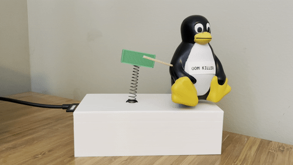
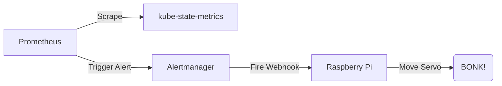

# oom-bonker
A delightfully silly way to be alerted when your Kubernetes containers run out of memory. 



# Why?
After seeing Justin Garrison's [beautiful depiction](https://twitter.com/rothgar/status/1514994851661582341) of how the Linux oom-killer works in real life, I was inspired to make this desk toy notify me when my own Kubernetes cluster had containers succumb to the [Out of Memory Killer](https://docs.rackspace.com/support/how-to/linux-out-of-memory-killer/).

# Components
This project relies on a Prometheus instance configured to scrape metrics from the [kube-state-metrics](https://github.com/kubernetes/kube-state-metrics) exporter. Alert Manager is then configured to fire a webhook to a Raspberry Pi running a small Python app. This app maintains the current position of the servo and signals it to move, resulting in a satisfying bonk.



# Repo Contents
This repo contains the software components needed for the OOM Bonker. Additional information on hardware will be on my blog soon.

## Webhook
[webhook.py](webhook.py) is a small Flask app that accepts a webhook from Prometheus Alertmanager. When a hook is posted with a status of `firing`, it will move the servo connected to the Pi via its GPIO pin.

[bonker.service](bonker.service) contains a SystemD unit for running this app as a daemon. Configuring a proper webserver would be ideal, but this works for our limited use case.

```
sudo mkdir /opt/bonker
sudo cp webhook.py /opt/bonker/
sudo cp bonker.service /etc/systemd/system/
sudo systemctl daemon-reload
sudo systemctl enable bonker --now
```

## Prometheus Configuration
Assuming you already have a working Prometheus instance, you can create an alerting rule to detect pod containers killed due to OOM. If you're using the Prometheus operator, you can use the included PrometheusRule.

```bash
kubectl create -f k8s/prom_rule.yml
```

You'll then need to update your Alertmanager config to include a receiver for your new webook and a route to send your OOMKilled alerts to this receiver. For reference, my config is below. 

```yaml
receivers:
  - name: oom-bonker
    webhook_configs:
      - url: 'http://1.2.3.4:5000/hook'
        send_resolved: false
route:
  group_by:
    - namespace
  group_interval: 5m
  group_wait: 30s
  receiver: Default
  repeat_interval: 12h
  routes:
    - receiver: oom-bonker
      match:
        alertname: OOMKilled
```

## Test Pod
To make end-to-end testing easier, [k8s/hungry_pod.yml](k8s/hungry_pod.yml) includes a pod that will attempt to consume infinite memory. It will trigger an OOM condition 10 seconds after starting.

```bash
kubectl create -f k8s/hungry_pod.yml
```

If all goes well, you should see alerts firing to your webhook shortly.
